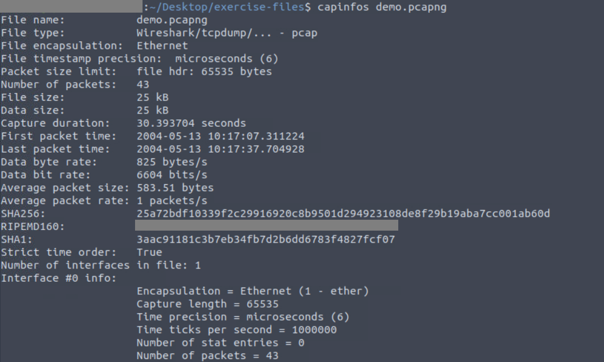
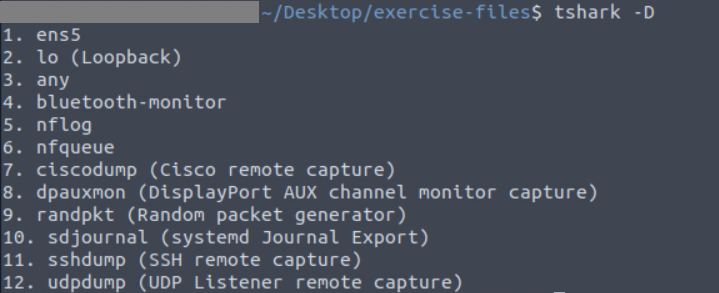
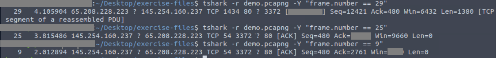
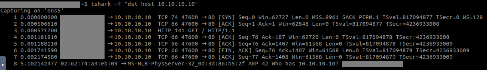

Welcome to the TShark Room on Try Hack Me! 

So, it is extremely important to get your **Wireshark** basics clear before starting this room as Wireshark has a GUI interface which makes it much easier for beginners to learn and have a good hands-on.

>TShark is a *command-line version* of Wireshark used for packet analysis, so you must also have some knowledge about basic Linux commands under your belt. 

Also, what I like the most about these command-line tools is that they offer you with more power, and flexibility and always have some room for automation.

Alright, let's get started!

**TASK 1: Introduction ---> Self Explainatory**
---
**TASK 2: Command-Line Packet Analysis Hints**
---
This task lists the common CLI tools that would be handy to know for packet analysis.

We simply need to navigate to `cd Desktop/exercise-files/`

**1. What is the "RIPEMD160" value?**

To get the answer we need to analyze the _demo.pcapng_ file using

```bash
capinfos demo.pcapng
```

which provides us with a summary of the capture file and our answer is amongst the one of the listed key-value pairs.



**TASK 3: TShark Fundamentals I**
---

This task deals with the parameter use and how it can be a game changer by helping us cut through the noise and help us get the desired output.

### Sniffing

Sniffing is basically capturing and monitoring network traffic and is one of the ways to eavesdrop on data as it travels across a network.

Using the parameters mentioned above we can choose the desired interface to sniff the traffic. If we do not give any parameters then it goes with the first available interface by default.

**1. What is the installed TShark version in the given VM?**

We can simply answer this using

```bash
tshark -v  
```
The first line that appears after executing this command is your answer.
It will be something like 

TShark (Wireshark) `$.$.$` where $ is used as a placeholder here.


**2. List the available interfaces with TShark. What is the number of available interfaces in the given VM?**

We can simply answer this using

```bash
tshark -D  
```




**TASK 4: TShark Fundamentals I - Main Parameters**
---

This section lists the parameters that would help us with packet analysis in many different ways. Basically, these parameters replicate different windows and functions of the Wireshark GUI.

THM has provided a wonderful comparison linking the output displayed on TShark Vs Wireshark GUI, you should definitely check that out!

**1. What are the assigned TCP flags in the 29th packet?**

So, if we follow according to the paramters mentioned above we can do this by 

```bash
tshark -r demo.pcapng -c 29
```
You can simply identify the TCP flags associated with packet 29, which will be in `[ , ]`

In Wireshark, it is pretty straightforward using the `Go to packet` functionality, but here in TShark, it lists all the packets till our desired packet.

I personally did not like this way of getting to this answer because it leaves the terminal cluttered with packets, imagine how the terminal would look if we had to look for the 10001th packet!

Don't worry, I've got your back, we can use something like 

```bash
tshark -r demo.pcapng -Y "frame.number == 29"
```

where `-Y is the parameter for display filter`, which helps us display only that particular packet, keeping the terminal tidy.

**2. What is the "Ack" value of the 25th packet?**

Following the way that I showed above (you can also opt for the basic `-c 25` ), we can do something like

```bash
tshark -r demo.pcapng -Y "frame.number == 25"
```

where you have your answer in `Ack=='   '`

**3. What is the "Window size value" of the 9th packet?**

Similarly,

```bash
tshark -r demo.pcapng -Y "frame.number == 9"
```
where you have your answer in `Win=='   '`

I have attached a snapshot for your reference.



**TASK 5: TShark Fundamentals II - Capture Conditions**
---

Here, we learn about the capture conditions which are useful when sniffing packets. It does not work with Pcap files. Here the parameters are used for storing the captured packets to a file by helping define the parameters for the same like duration, filesize, or the number of files.

Theoretical questions that you can easily answer!

**TASK 6: TShark Fundamentals III - Filters**
---

Here, we discuss about the two types of filters - `Capture and Display`

The concept remains the same for someone who has already explored Wireshark, but here's a compact version that might help!

<table border="2">
  <tr>
    <th>Parameter</th>
    <th>Capture</th>
    <th>Display</th>
  </tr>
  <tr>
    <td>Usecase</td>
    <td>To filter live traffic and save it to a file</td>
    <td>To filter captured traffic</td>
  </tr>
  <tr>
    <td>Point of application</td>
    <td>Before live capture</td>
    <td>Post capture</td>
  </tr>
  <tr>
    <td>Number of packets</td>
    <td>Remains unchanged</td>
    <td>Reduces visible packets</td>
  </tr>
  <tr>
    <td>Flag used</td>
    <td>-f</td>
    <td>-Y</td>
  </tr>
</table>

Theoretical questions that you can easily answer!

**TASK 7: TShark Fundamentals IV - Capture Filters**
---

For this task on the VM just go to `Applications --> System Tools --> Terminator`

Now follow the instructions as provided.

**1. What is the number of packets with SYN bytes?**

Since there are only 14 packets, you can simply count the number of packets with SYN bytes manually.

**2. What is the number of packets sent to the IP address "10.10.10.10"?**

One way to get the answer is by simply counting the number of packets where the destination IP address is the above-mentioned IP address.

But applying a filter can also give us the answer which can be done using

```bash
tshark -f "dst host 10.10.10.10"
```

> <span style="color: #ef233c;">Note:</span> Before you do this make sure you terminate the current packet capture and then use the above command. Also, you need to run the curl command again to sniff traffic.



Note : Here the last one is ARP Broadcast, so we won't count it as one of the packets sent to mentioned destination IP.  

**3. What is the number of packets with ACK bytes?**

Since there are only 14 packets, you can simply count the number of packets with ACK bytes manually.

**TASK 8: TShark Fundamentals V - Display Filters**
---

Here we have the display filters which are similar to what we have in Wireshark.

**1. What is the number of packets with a "65.208.228.223" IP address?**

Unlike Wireshark, Tshark does not display a total number of packets after filtering anywhere. So, we use `nl` command along with our filter to get the number of filtered packets without any hassle.

We can do this by

```bash
tshark -r demo.pcapng -Y 'ip.addr==65.208.228.223' | nl
```

Once you enter this comamnd you get a numbered list on the leftmost column and you can take the number of filtered packets from there.

**2. What is the number of packets with a "TCP port 3371"?**

You can get the answer by using 

```bash
tshark -r demo.pcapng -Y 'tcp.port==3371' | nl
```

**3. What is the number of packets with a "145.254.160.237" IP address as a source address?**

You can get the answer by using 

```bash
tshark -r demo.pcapng -Y 'ip.src==145.254.160.237' | nl
```
**4. What is the packet number of the "Duplicate" packet?**

Duplicate packets are shown as "TCP/UDP Dup.."

Note: We need the packet number here, do not get confused by the list number which we use to find the total number of packets.


### Congratulations on completing this room ! &#127881;
<br>

# Professional Analysis

### Detection & Impact

<div style="text-align: justify;">
I highly value packet analysis because it enables the detection of an attacker’s earliest activities, whether reconnaissance or eavesdropping. TShark, the command-line counterpart of Wireshark, allows for detailed capture and examination of network traffic. Security teams can identify suspicious use of tools like TShark by monitoring endpoint behaviors and command execution logs. Additionally, TShark using specific filters can detect unusual sniffing activity by analyzing traffic for unauthorized captures or abnormal patterns. It can also detect attacks like SYN flooding or Man in the Middle (MITM) attacks. If such actions go unnoticed, attackers could exploit vulnerable protocols and intercept sensitive information like credentials, potentially resulting in unauthorized access and data exfiltration.
</div>

### Real-World Application

<div style="text-align: justify;">
Packet analysis is a valuable skill for security analysts when evaluating an organization’s security posture. Tools like TShark can help identify which protocols are in use across systems, assess their security, and uncover potential vulnerabilities or misuse. For example, The use of insecure protocols such as HTTP (80), FTP (21), Telnet (23), or SMTP (25) can expose systems to eavesdropping and credential theft. While these protocols are inherently insecure, packet analysis can also reveal downgrade attempts in protocols that support encryption such as TLS where attackers force communication to fall back to a weaker, older version. By understanding how attackers capture and analyze traffic, security teams can better configure monitoring tools and enforce encrypted alternatives like TLS to safeguard sensitive information. This knowledge not only aids in detecting malicious behavior but also enhances proactive threat hunting and overall network defense.  
</div>

### Security Implications

<div style="text-align: justify;">
Packet capturing tools like TShark pose a significant security risk when used maliciously, as they enable attackers to silently monitor network traffic and potentially steal sensitive data. For businesses, this can lead to credential theft, intellectual property loss, and regulatory compliance violations. To mitigate these risks, it's essential to implement strong network segmentation, enforce encryption, deploy robust monitoring controls, and educate employees about threats such as unauthorized packet sniffing, ARP spoofing, denial-of-service (DoS) attacks, and downgrade exploits. Users should be encouraged to report any suspicious activity to the security team promptly. Additionally, since social engineering remains the leading cause of cyberattacks, creating a strong security culture and ongoing user awareness training are equally critical to protecting organizational assets.
</div>